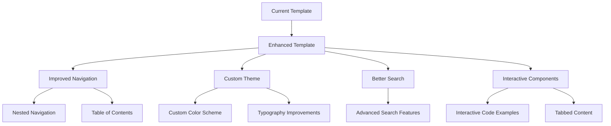
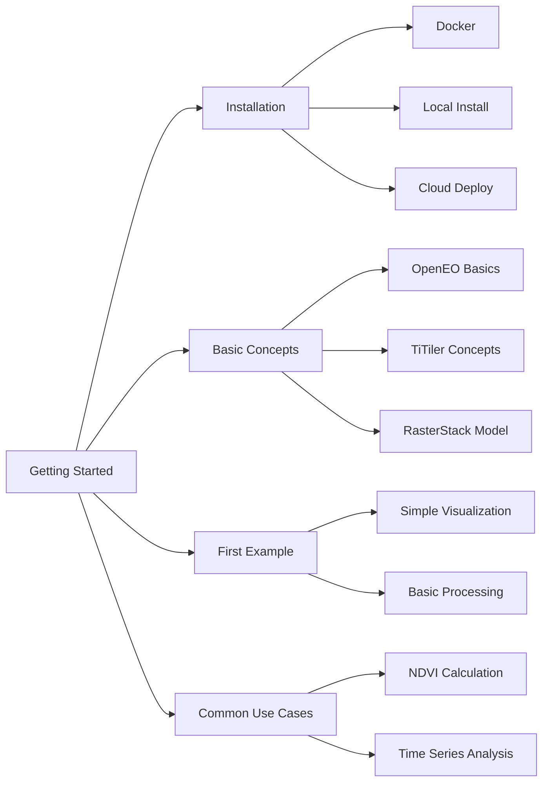
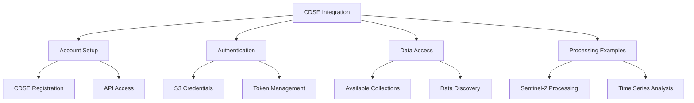
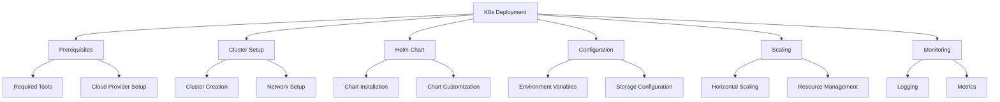
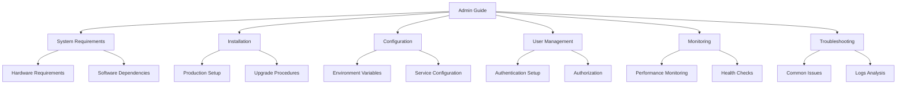
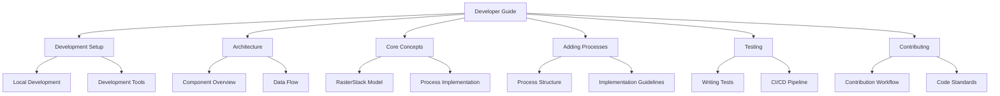

# Documentation Enhancement Plan

This document outlines the plan for enhancing TiTiler-OpenEO's documentation.

## Overview

The documentation enhancement project includes six major components:
1. MkDocs template improvements
2. Getting Started guide
3. CDSE reference deployment guide
4. Kubernetes deployment guide
5. Admin guide
6. Developer guide

## 1. MkDocs Template Improvements

The current documentation uses Material for MkDocs. Planned enhancements include:

**Specific Improvements:**
- Update to the latest Material for MkDocs version
- Create a custom theme with Development Seed and Sinergise branding
- Implement a more intuitive navigation structure
- Add interactive components like tabbed content and collapsible sections
- Enhance code highlighting and examples
- Improve mobile responsiveness
- Add a version selector for documentation versions

## 2. Getting Started Guide

A comprehensive guide covering:

**Content Structure:**
1. **Introduction**: What is TiTiler-OpenEO and why use it
2. **Prerequisites**: Required software and knowledge
3. **Installation**: Step-by-step installation instructions for different environments
4. **Configuration**: Setting up environment variables and services
5. **First Steps**: Connecting to the API and exploring available collections
6. **Basic Example**: Complete walkthrough of a simple use case
7. **Next Steps**: Pointers to more advanced topics

## 3. CDSE Reference Deployment Guide

Focus on using TiTiler-OpenEO with Copernicus Data Space Ecosystem:

**Content Structure:**
1. **CDSE Introduction**: Overview of the Copernicus Data Space Ecosystem
2. **Account Setup**: How to register and get API access
3. **Authentication**: Setting up S3 credentials and authentication
4. **Configuration**: Configuring TiTiler-OpenEO for CDSE
5. **Data Discovery**: Finding and exploring available collections
6. **Processing Examples**: Step-by-step examples specific to CDSE data
7. **Performance Optimization**: Tips for efficient processing with CDSE
8. **Troubleshooting**: Common issues and solutions

## 4. Kubernetes Deployment Guide

A comprehensive guide for deploying on Kubernetes:

**Content Structure:**
1. **Introduction**: Why deploy on Kubernetes
2. **Prerequisites**: Required tools and knowledge
3. **Cluster Setup**: Step-by-step instructions for different cloud providers
4. **Helm Chart Installation**: Detailed installation instructions
5. **Configuration**: Customizing the deployment
6. **Scaling**: Handling increased load
7. **Monitoring and Logging**: Setting up observability
8. **Maintenance**: Upgrades, backups, and troubleshooting
9. **Security Considerations**: Best practices for securing the deployment

## 5. Admin Guide

Administration guide for maintaining a TiTiler-OpenEO deployment:

**Content Structure:**
1. **System Overview**: Architecture and components
2. **Installation**: Production-ready installation
3. **Configuration**: Detailed configuration options
4. **Authentication**: Setting up and managing authentication
5. **Services Management**: Managing STAC services and collections
6. **Performance Tuning**: Optimizing for different workloads
7. **Monitoring**: Setting up monitoring and alerts
8. **Backup and Recovery**: Data persistence strategies
9. **Troubleshooting**: Common issues and solutions
10. **Security**: Best practices for securing the deployment

## 6. Developer Guide

Detailed information for developers:

**Content Structure:**
1. **Development Environment**: Setting up a development environment
2. **Architecture Overview**: Detailed explanation of the system architecture
3. **Core Concepts**: In-depth explanation of key concepts
4. **Code Organization**: Structure of the codebase
5. **Adding New Processes**: How to implement and register new processes
6. **Testing**: Writing and running tests
7. **API Documentation**: Detailed API reference
8. **Contributing Guidelines**: How to contribute to the project
9. **Release Process**: How releases are managed
10. **Future Development**: Roadmap and planned features

## Implementation Order

1. **Template Upgrade**: Start with upgrading the MkDocs template to provide a better foundation for all other documentation.
2. **Getting Started Guide**: Create a comprehensive getting started guide to help new users.
3. **CDSE Guide**: Develop the guide for using TiTiler-OpenEO with CDSE.
4. **Developer Guide**: Enhance the existing contributing documentation into a full developer guide.
5. **Admin Guide**: Create an administration guide for system administrators.
6. **K8s Deployment Guide**: Develop the Kubernetes deployment guide.

## Next Steps

- [ ] Create issues for each major documentation component in [GitHub Issues](https://github.com/sentinel-hub/titiler-openeo/issues)
  1. [MkDocs Template Upgrade - Issue #1](https://github.com/sentinel-hub/titiler-openeo/issues)
  2. Getting Started Guide (to be created)
  3. CDSE Guide (to be created)
  4. Developer Guide (to be created)
  5. Admin Guide (to be created)
  6. K8s Deployment Guide (to be created)
- [ ] Set up development environment for documentation work
- [ ] Begin with MkDocs template upgrade (see Issue #1)
- [ ] Start working on getting started guide while template is being reviewed
- [ ] Coordinate with team for technical review of each section
- [ ] Set up automated documentation testing if not already in place
