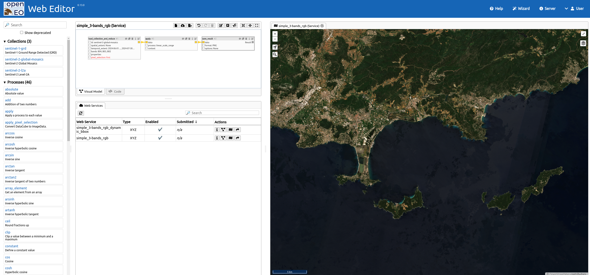

# openEO by TiTiler

TiTiler backend for openEO

## Overview

openEO by TiTiler is a TiTiler backend implementation for openEO developed by [{: style="height:25px"}](https://developmentseed.org/) and [{: style="height:25px"}](https://www.sinergise.com/).

The main goal of this project is to provide a light and fast backend for openEO services and processes using the TiTiler engine.
This simplicity comes with some specific implementation choices like the type of data managed by the backend.
It is focused on image raster data that can be processed on-the-fly and served as tiles or as light dynamic raw data.
For more details about the implementation choices, see the [Concepts](concepts.md) section.

The application implements the [openEO API (L1A and L1C)](https://openeo.org/documentation/1.0/developers/profiles/api.html#api-profiles) profiles.

## Features

- STAC API integration with external STAC services
- Synchronous processing
- Various output formats (e.g., JPEG, PNG)
- Multiple supported processes
- Dynamic tiling services
- FastAPI-based application
- Middleware for CORS, compression, and caching
- Optimized RasterStack data model for consistent processing
- LazyRasterStack implementation for improved performance

## Getting Started

For installation and setup instructions, see:
- [Local Setup](local-setup.md) for development environment
- [Kubernetes Guide](kubernetes.md) for production deployment
- [Administrator Guide](admin-guide.md) for configuration options

## Documentation Structure

- **Project**: Overview and release notes
- **Architecture**: Core concepts and data models
- **Deployment**: Installation and configuration guides
- **Development**: Contributing guidelines

## License

This project is licensed under the [MIT License](https://github.com/sentinel-hub/titiler-openeo/blob/main/LICENSE).

## Authors

Created by [Development Seed](https://developmentseed.org/) and [Sinergise](https://www.sinergise.com/).

See [contributors](https://github.com/sentinel-hub/titiler-openeo/graphs/contributors) for a listing of individual contributors.
